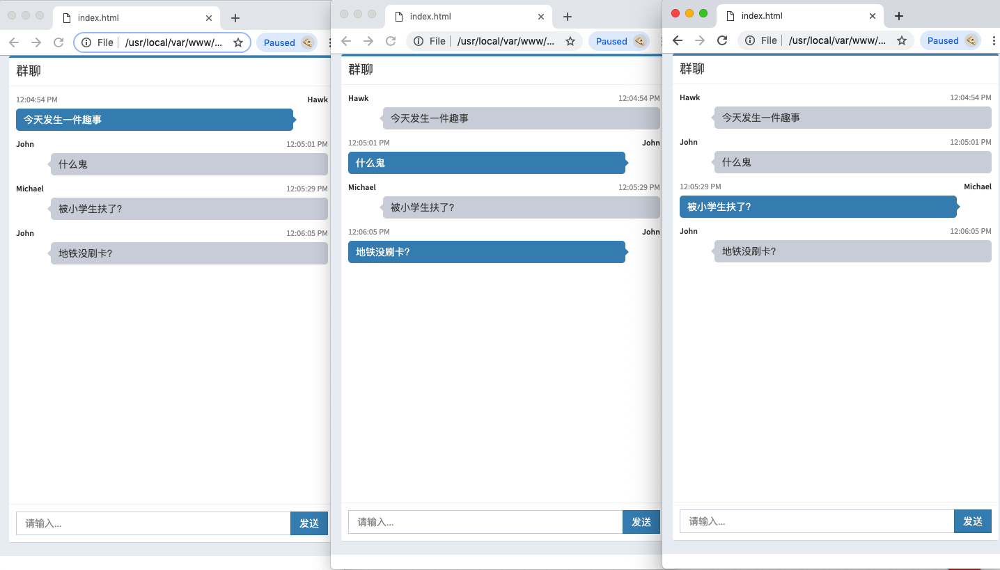

### Description

Simple broadcast group chat demo implemented with:

* `map`, store websocket connections
* `sync.RWMutex`, cocurrent read and write map
* `channel`, read and write message
* `http.FileServer`, serve static files like css, js, etc.
* `http.ListenAndServe`, http server
* `gorilla.websocket`, upgrade http connection to websocket connection

### Run

```go
go run main.go
```

then open several tabs and visit

```go
http://localhost:8000
```