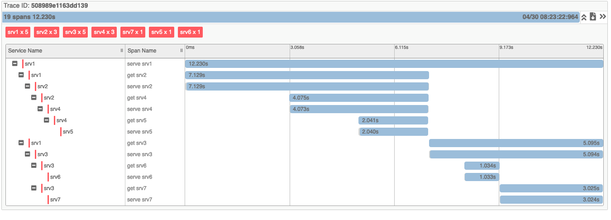

启动`zipkin`和所有`service`

```go
cd go-demos/tracing
docker-compose up -d
```

查看所有`container`是否正常运行，如果端口被占用需更改`docker-compose.yml`

```go
docker ps -a
CONTAINER ID        IMAGE               COMMAND                CREATED             STATUS              PORTS                              NAMES
e3f8a02f9a80        tracing_srv1        "go run main.go"       2 hours ago         Up 4 minutes        0.0.0.0:65512->65512/tcp           tracing_srv1_1
aa39a331bd2e        tracing_srv6        "go run main.go"       2 hours ago         Up 4 minutes        0.0.0.0:65517->65517/tcp           tracing_srv6_1
25f953e88689        tracing_srv4        "go run main.go"       2 hours ago         Up 4 minutes        0.0.0.0:65515->65515/tcp           tracing_srv4_1
10bc63ec435b        tracing_srv7        "go run main.go"       2 hours ago         Up 4 minutes        0.0.0.0:65518->65518/tcp           tracing_srv7_1
b381b6b8ca85        tracing_srv5        "go run main.go"       2 hours ago         Up 4 minutes        0.0.0.0:65516->65516/tcp           tracing_srv5_1
5cb5ff5d7782        tracing_zipkin      "/busybox/sh run.sh"   2 hours ago         Up 4 minutes        9410/tcp, 0.0.0.0:9411->9411/tcp   tracing_zipkin_1
5f7a079a7543        tracing_srv3        "go run main.go"       2 hours ago         Up 4 minutes        0.0.0.0:65514->65514/tcp           tracing_srv3_1
694d5ab3772e        tracing_srv2        "go run main.go"       2 hours ago         Up 4 minutes        0.0.0.0:65513->65513/tcp           tracing_srv2_1
```

各服务的调用关系如下图：


访问`srv1`服务，启动整个调用链:

```go
http://localhost:65512/trace
```

访问`zipkin`的`web`页面，查看调用链关系：

```go
http://localhost:9411/zipkin
```

如下图：

